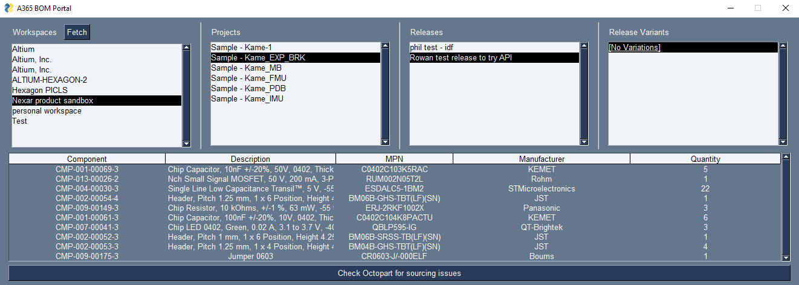
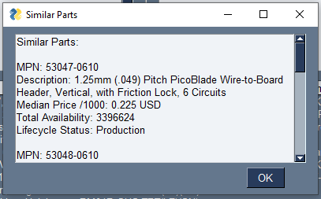
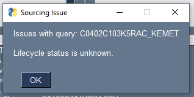
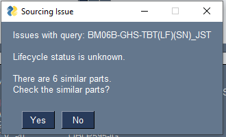

# Altium 365 BOM Checker

This example combines both the supply and design sides of the Nexar API. It fetches Altium 365 workspaces, projects, releases and variants. You select a specific variant to retrieve the BOM of. Then you can check against Octopart data for any potential sourcing issues and see any similar parts that may be available instead.

## Prerequisites

To use this example you will need the following:

- A Nexar account - [Login or signup here](https://identity.nexar.com/Account/Login).

- The "Similar Parts" add-on - [our plans and add-ons](https://nexar.com/compare-plans). If you do not have this add-on, the majority of the functionality will work, just not the checking for similar parts at the end.

- An Altium 365 workspace with a project and a release of that project.

- A Nexar application with the supply and design scopes enabled.

- You will need to set your client ID and secret for the application mentioned above in your environment variables. Set them as NEXAR_CLIENT_ID and NEXAR_CLIENT_SECRET. Alternatively, you can set them as their variables in `python/apiQueries.py` but do not share these credentials publicly.

- This example uses `PySimpleGui` and other Python packages. To install them, run the command `pip install -r requirements.txt`

## The Code

An overview of each part of this example.

### nexarClient

This folder contains the `NexarClient` class that handles authorization and has a generic `get_query` function to query the Nexar API.

### apiQueries.py

Contains all of the API queries and also functions that specifically return the data that will be used.

### program.py

Contains the code to create the GUI.
